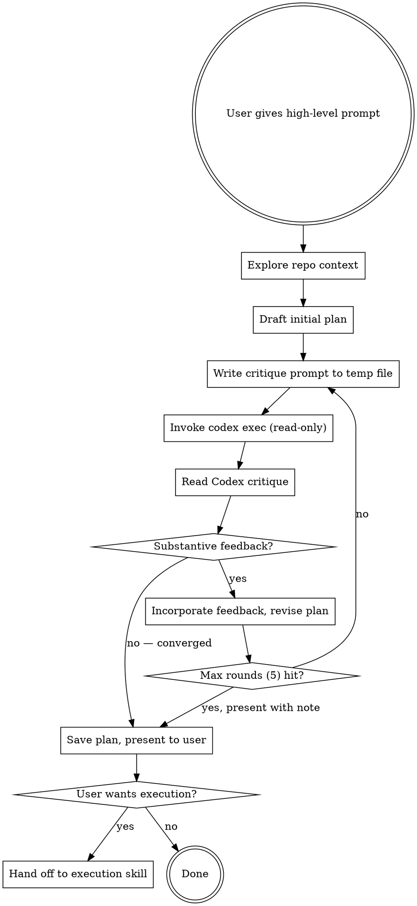

# Double Plan Mode

## Overview

Produce battle-tested plans by running an automated adversarial critique loop between you (Claude) and Codex CLI. You draft, Codex tears it apart, you revise, repeat until stable.

## When to Use

- User explicitly asks for "double plan mode" or wants extra rigor on a plan
- High-stakes planning where blind spots could be costly
- When you want a second model's perspective on feasibility and completeness

**Not for:** Quick plans, trivial tasks, or when Codex CLI is unavailable.

## Process



## Step-by-Step

### 1. Explore

Review the repo — files, structure, dependencies, recent changes. Understand enough context to write a meaningful plan.

### 2. Draft

Write an initial plan based on the user's prompt and repo context. Structure it clearly with sections, steps, and rationale.

### 3. Critique Loop

For each round (max 5):

**a) Prepare the critique prompt.** Write to `/tmp/double-plan-critique-{round}.md`:

Round 1 template:
```markdown
# Plan Critique Request

## User's Goal
{user's original prompt}

## Plan to Review
{full current plan text}

## Your Task
You are a senior engineer reviewing this implementation plan. Be adversarial.
Find problems, not validation.

Critique on these dimensions:
- **Completeness**: Missing steps, unaddressed requirements, gaps?
- **Feasibility**: Unrealistic steps given the codebase? Wrong assumptions?
- **Edge cases**: What could go wrong that the plan doesn't cover?
- **Dependencies**: Ordering issues, missing prerequisites, circular deps?
- **Risk**: Highest-risk areas? What could cause failure?
- **Clarity**: Steps ambiguous enough that an implementer would get stuck?

Do NOT rewrite the plan. Only critique it. Be specific.
For each issue, state severity: CRITICAL | MAJOR | MINOR.
```

Round 2+ adds:
```markdown
## Changes Since Last Round
{summary of revisions}

## Previous Critique
{Codex's last critique}

Review the FULL plan again. Are previous issues fixed? Did revisions introduce new problems?
```

**b) Invoke Codex.** Run non-interactively with read-only repo access:

```bash
codex exec \
  -C "$(pwd)" \
  --sandbox read-only \
  -o /tmp/double-plan-response-{round}.md \
  - < /tmp/double-plan-critique-{round}.md
```

Timeout: 5 minutes per invocation.

**c) Read the critique** from `/tmp/double-plan-response-{round}.md`.

**d) Evaluate convergence.** Judge whether remaining feedback is substantive:
- **CRITICAL or MAJOR issues remain** → incorporate, revise, next round
- **Only MINOR issues or cosmetic feedback** → converged, exit loop

### 4. Finalize

Save the converged plan to `docs/plans/YYYY-MM-DD-<topic>-double-plan.md` with this structure:

```markdown
# {Topic} — Plan (Double-Reviewed)

## Original Prompt
{user's prompt}

## Plan
{final plan}

## Critique History
### Round 1
**Codex flagged:** {summary}
**Changes made:** {summary}
### Round N...
### Convergence
Stable after {N} rounds. Remaining minor feedback: {list or "none"}.
```

Present the plan and ask: "Plan is stable after N rounds. Proceed to execution, or keep as-is?"

If execution, choose the appropriate skill:
- `writing-plans` — plan needs decomposition into bite-sized TDD steps
- `executing-plans` — plan is detailed, executing inline
- `subagent-driven-development` — independent tasks, can parallelize

## Failure Handling

| Scenario | Action |
|----------|--------|
| Codex CLI fails/times out | Retry once. If still fails, present plan as-is. |
| Codex returns empty/garbage | Retry with rephrased prompt. If still fails, converge. |
| Oscillation (round N contradicts round N-2) | Claude makes judgment call, documents trade-off. |
| Prompt too vague to plan | Ask clarifying questions BEFORE entering loop. |
| Max rounds (5) without convergence | Present plan with note, let user decide. |

## Cleanup

After convergence, remove temp files:
```bash
rm -f /tmp/double-plan-critique-*.md /tmp/double-plan-response-*.md
```
